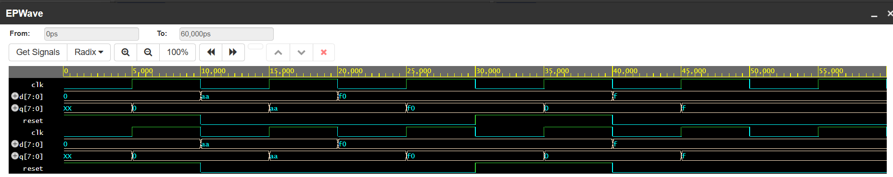

# 🔧 8-bit Register with Synchronous Reset (Verilog)

## 📚 Description
This project implements a simple 8-bit synchronous register in Verilog HDL.  
The register stores 8-bit input data (`d`) on the rising edge of the clock (`clk`).  
If `reset` is high, the output (`q`) is cleared to 0 synchronously.

---

## 📁 Files Included
- `register_8bit.v` – Verilog code for the 8-bit register
- `register_8bit_tb.v` – Testbench to verify the register's functionality
- `waveform.png` – Screenshot of simulated waveform using EPWave (optional)

---

## 🛠️ Simulation Details
- **Simulator Used**: Icarus Verilog via EDA Playground  
- **Testbench**:
  - Clock toggled every 10ns
  - Reset asserted and deasserted to observe behavior
  - Input values (`d`) changed at different timestamps
- **Waveform Viewer**: EPWave (VCD format)

---

## ✅ Output Logic
| Time | reset | d         | q         |
|------|-------|-----------|-----------|
| 0ns  | 1     | 00000000  | 00000000  |
| 10ns | 0     | 10101010  | 10101010  |
| 20ns | 0     | 11110000  | 11110000  |
| 30ns | 1     | ----      | 00000000  |
| 40ns | 0     | 00001111  | 00001111  |

---

## 🖼️ Sample Waveform  

---

## 📌 How to Run the Simulation
1. Go to [EDA Playground](https://edaplayground.com)
2. Paste `register_8bit.v` in Design file
3. Paste `register_8bit_tb.v` in Testbench file
4. Use Icarus Verilog + Tick “Open EPWave after run”
5. Run and observe the waveform

---

